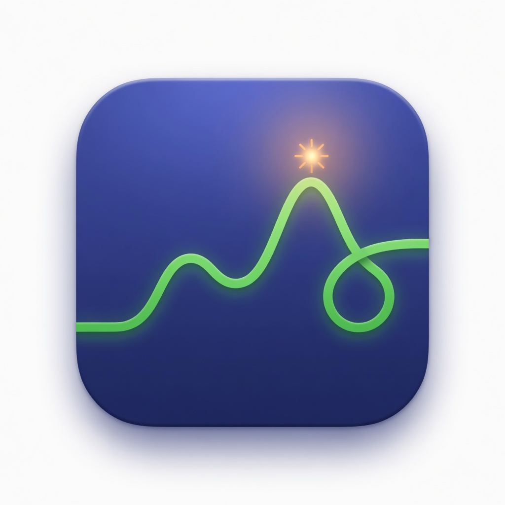

# Open Activity

Open Activity is a free, MIT-licensed activity monitor for macOS. It lives in the menu bar, folds helper processes into the app that owns them, and asks before it quits anything.



The menu-bar item shows live CPU. Click it for the glance panel, which follows the Mac's light or dark appearance. Right-click an app there to quit it or force quit it. The main window shows CPU, memory, disk, network, GPU, battery, and local dev projects. Neither Quit nor Force Quit runs until you confirm.

Usage history stays on this Mac for 30 days (`~/Library/Application Support/Appfold/history.jsonl`). You can read the last 12 hours, 24 hours, 7 days, and 30 days. Samples older than 30 days are deleted. A sustained high CPU, a sustained memory climb, and heavy disk or network show a local alert. Quiet apps do not. There is no account, license key, or network service.

## Light on purpose

Open Activity is a small AppKit program. It does not ship a browser or a web view. With the windows closed it samples every 5 seconds. With a window open it samples about every 2 seconds. Per-process CPU, memory, disk, and energy come from the counters macOS already exposes. Per-process network bytes are not available to a normal app, so that column stays blank instead of showing an invented number. System network is the traffic counted on this Mac's interfaces. Power by app is the energy macOS bills to those processes, shown in watts or milliwatts.

The source target is still named `Appfold`. The app you launch is **Open Activity**.

## Build and run

Requires macOS 13 or later.

```bash
swift test
Scripts/package-app.sh
open .build/Appfold.app
```

The package script builds a release app and ad-hoc signs it so Launch Services will open it. The app is not sandboxed, because a sandbox cannot see other apps' processes.

## License

[MIT](LICENSE). Use it, change it, and share it.
