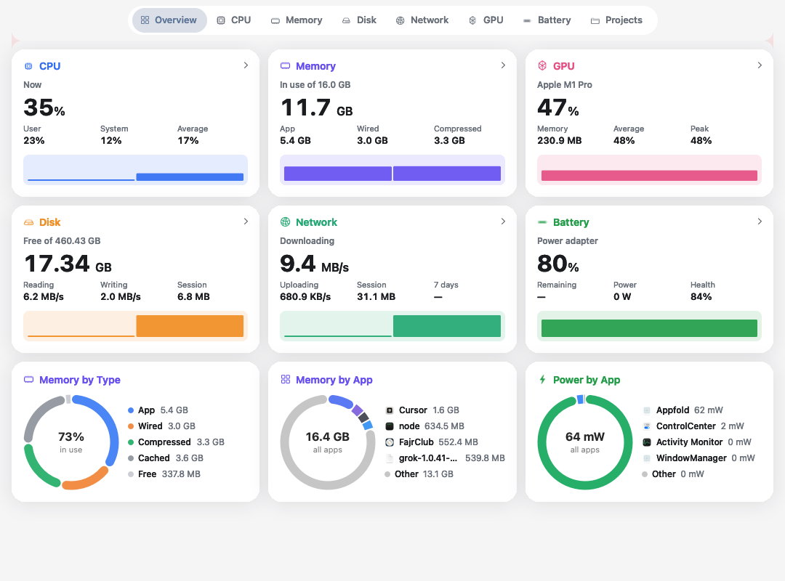

<p align="center">
  
</p>

<h1 align="center">MacMom</h1>

<p align="center">
  A free menu-bar activity monitor for macOS.<br>
  It watches the Mac, folds helper processes into the app that owns them, and asks before it quits anything.
</p>

<p align="center">
  <a href="LICENSE"></a>
  
  <a href="https://github.com/theprincesajjad/MacMom/releases"></a>
</p>

<p align="center">
  
</p>

## What it does

MacMom sits in the menu bar and shows live CPU. Click the icon to open the panel. Click it again to close it. The panel follows Light Mode and Dark Mode.

The main window has eight pages:

| Page | What you see |
| --- | --- |
| Overview | CPU, memory, disk, network, GPU, and battery, plus memory and power by app |
| CPU, Memory, Disk, Network, GPU, Battery | The current figure, a chart, four summary cards, and the apps behind that figure |
| Projects | Local dev servers, with ports, status, and memory |

Helpers that live inside an app, and processes that app launched, count toward that app. A different app stays separate. A process that belongs to no app is still listed.

Right-click an app, or use the × on its row in the menu-bar panel, to quit it or force quit it. MacMom always asks first. Cancel leaves the app running.

## Install

Download [MacMom 1.0](https://github.com/theprincesajjad/MacMom/releases/tag/v1.0.0) for Apple silicon, unzip it, and move the app to Applications.

The build is ad-hoc signed, not notarized. The first time you open it, right-click the app and choose Open.

Requires macOS 13 or later.

## Build from source

```bash
git clone https://github.com/theprincesajjad/MacMom.git
cd MacMom
swift test
Scripts/package-app.sh
open .build/Appfold.app
```

The package script builds a release app and ad-hoc signs it. The Swift target is still named `Appfold`. The app you see is MacMom.

MacMom is not sandboxed, because a sandbox cannot see other apps' processes.

## Privacy

Everything stays on this Mac. There is no account, license key, or network service.

History is kept for 30 days in `~/Library/Application Support/Appfold/history.jsonl`. Samples older than 30 days are deleted. With the windows closed, MacMom samples every 5 seconds. With a window open, it samples about every 2 seconds.

A sustained high CPU, a climbing memory use, or a heavy disk or network burst shows a local alert. A one-off spike does not.

## Measurements

MacMom only shows counters macOS provides.

- CPU, memory footprint, disk, and billed energy come from the process counters.
- Memory in use is app memory, wired memory, and compressed memory from the same kernel read.
- Power by app is that billed energy, shown in watts or milliwatts.
- Per-app network bytes are not available to a normal app, so those values stay blank.
- Per-app GPU use stays blank when macOS does not report it.

## License

[MIT](LICENSE). Use it, change it, and share it.
